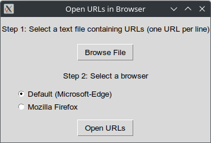
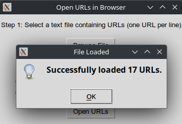
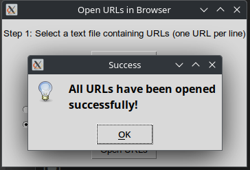
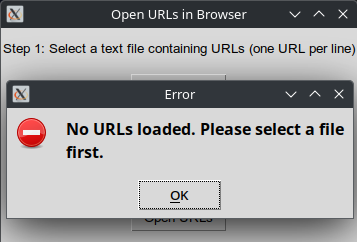

# URL Launcher GUI

This Python project provides a graphical interface to load URLs from a text file and open them in a selected browser. The program dynamically detects installed browsers and allows adding custom browser commands.

## Features
- Load URLs from a `.txt` file (one URL per line).
- Detect installed browsers dynamically.
- Open URLs in the selected browser.
- Add custom browser commands.
- Simple and user-friendly GUI.

## Prerequisites
- Python 3.x
- Installed browsers (e.g., Google Chrome, Mozilla Firefox, etc.)
- Required Python modules: `tkinter`, `webbrowser`, `shutil`

## Installation
1. Clone the repository:
  ```bash
  git clone https://github.com/your-username/tkinter_open_urls.git
  cd tkinter_open_urls
  ```
2. Install required modules:
  ```bash
  pip install -r requirements.txt
  ```

## Usage
1. Run the program:
  ```bash
  python url_launcher.py
  ```

2. Follow these steps:
   - Select a .txt file containing URLs (one URL per line).
   - Choose a browser from the listed options or add a custom browser.
   - Click "Open URLs" to open all URLs in the selected browser.

## Screenshots








## License
This project is licensed under the MIT License. See the [LICENSE](LICENSE "Licence file") file for details.


## Contributing
We welcome contributions from the community! If you have an idea for a feature, bug fix, or improvement, we’d love to hear from you. Here’s how you can contribute:

1. Fork the repository: Click the "Fork" button at the top right of this page to create a copy of this repository on your GitHub account.

2. Create a branch: Use a descriptive name for your branch, such as feature/new-feature or bugfix/issue-xyz.

```bash
git checkout -b feature/new-feature
```
3. Make your changes: Implement your feature or bug fix.

4. Commit your changes: Write a clear and concise commit message.
```bash
git commit -m "Add new feature: description"
```

5. Push to your branch:
```bash
git push origin feature/new-feature
```

6. Open a pull request: Go to the original repository and click the "New pull request" button. Fill out the PR template and submit it.

We will review your pull request and provide feedback as needed. If you have any questions or need help, feel free to open an issue or reach out to us.

Thank you for your contributions!
